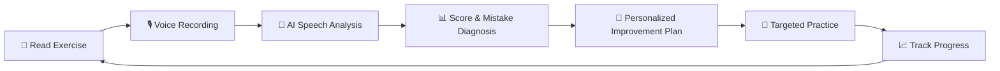

# VOPA — Multilingual AI Literacy Platform

> **VOPA** is a modern, multilingual AI-powered reading and literacy platform designed to help children build reading fluency, accuracy, and confidence. By combining real-time speech evaluation, actionable diagnostic feedback, personalized improvement pathways, and dedicated teacher and administrative oversight, VOPA transforms how foundational literacy is cultivated and measured.

---

## 🎯 The Core Learning Loop

At the heart of VOPA is a continuous, data-driven cycle designed to foster measurable literacy improvement:



---

## 👥 User Roles & Key Capabilities

VOPA provides tailored experiences for three core stakeholders:

### 1. 🎓 Student
- **Language & Level Selection:** Choose from configurable languages (e.g., English, Hindi, Tamil) and difficulty tiers.
- **Interactive Reading:** Read words, sentences, and passages aloud directly in the browser.
- **In-Browser Audio Capture:** Simple, intuitive microphone controls (Start, Stop, Retake, Submit).
- **Instant AI Feedback:** Instant score percentage, word-by-word correctness breakdown, and pinpointed pronunciation trouble spots.
- **Targeted Remediation:** Step-by-step guidance, phoneme/word practice recommendations, and level-adjusted exercises.
- **Self-Progress Journey:** Visual history of past reading attempts and streak milestones.

### 2. 👩‍🏫 Teacher
- **Actionable Class Dashboard:** High-level metrics on class averages, total reading attempts, and activity recents.
- **"Needs Attention" Alerts:** Proactive flagging of students falling below fluency benchmarks.
- **Student Drill-Downs:** Detailed historical trajectory ($75\% \rightarrow 78\% \rightarrow 82\%$), recurring mistake patterns, and audio review.
- **Language-Wise Analysis:** Compare cohort performance across different supported languages.

### 3. 🛠️ Administrator
- **User & Role Management:** Full CRUD over users, teachers, and students; assign students to teacher cohorts; role-based access control (RBAC).
- **Curriculum & Exercise Bank:** Create, edit, and categorize reading content with difficulty ratings and language tags.
- **Language Configuration:** Enable/disable languages, set default speech recognition models, and configure locale parameters dynamically.
- **System-Wide Analytics:** Track global adoption, average platform scores, most practiced exercises, and system health.

---

## 🔬 AI Speech Analysis Pipeline

The speech layer is designed with a **modular architecture** so underlying speech-to-text and pronunciation assessment engines can be swapped or upgraded without modifying business logic.

```
       [ Browser Microphone ]
                 │ (Audio Blob / WebM / WAV)
                 ▼
       [ Express Audio Handler ]
                 │ (Temporary/Object Storage)
                 ▼
    ┌───────────────────────────────┐
    │     AI Speech Service Layer   │
    │  - Speech Recognition (STT)   │
    │  - Text Alignment Algorithm   │
    │  - Pronunciation Assessment   │
    │  - Fluency & Pace Evaluation  │
    └───────────────────────────────┘
                 │
                 ▼
    ┌───────────────────────────────┐
    │       Diagnostic Engine       │
    │  • Word Accuracy: Correct/Miss │
    │  • Mistake Identification     │
    │  • Reading Score Calculation  │
    │  • Dynamic Improvement Plan   │
    └───────────────────────────────┘
                 │
                 ▼
      [ MongoDB Persistence & UI ]
```

### Scoring Logic
$$\text{Reading Score} = \left( \frac{\text{Correctly Recognized Words}}{\text{Total Expected Words}} \right) \times 100$$
*(Extensible to incorporate pronunciation clarity, fluency cadence, and phoneme accuracy).*

### Improvement Engine Rules
- **$\ge 90\%$ Score:** Advance to the next difficulty level or higher complexity vocabulary.
- **$75\% - 89\%$ Score:** Targeted repetition on specific mispronounced or dropped words.
- **$60\% - 74\%$ Score:** Multi-pass guided sentence practice with slower audio pacing.
- **$< 60\%$ Score:** Step down to foundational exercises with scaffolding and guided phonetic practice.

---

## 🛠️ Technology Stack

| Layer | Technologies |
| :--- | :--- |
| **Frontend** | React (Vite / Single Page Application), Vanilla Modern CSS / CSS Modules, Web Audio API, Lucide Icons |
| **Backend** | Node.js, Express.js (REST API Architecture) |
| **Database** | MongoDB, Mongoose ODM |
| **Authentication** | JWT (JSON Web Tokens), bcrypt password hashing, Role-Based Access Control (RBAC) middleware |
| **Audio & AI** | Multer for stream/file handling, pluggable speech-to-text & phonetic analysis service |
| **Tooling & Env** | npm, Git, ESLint, dotenv |

---

## 📁 Repository Structure (Planned)

```text
VOPA/
├── backend/
│   ├── config/             # DB connection, environment configuration
│   ├── controllers/        # Auth, exercises, readings, teacher, admin controllers
│   ├── middleware/         # Auth, RBAC (student/teacher/admin), upload validation
│   ├── models/             # User, Student, Teacher, Exercise, ReadingAttempt, ImprovementPlan, Language
│   ├── routes/             # API routes (/api/auth, /api/exercises, /api/readings, etc.)
│   ├── services/           # Speech/AI analysis, scoring, improvement planning logic
│   ├── utils/              # Text normalization, scoring helpers
│   ├── server.js           # Express app entry point
│   └── package.json
│
├── frontend/
│   ├── public/             # Static assets, fonts, icons
│   ├── src/
│   │   ├── assets/         # Images, illustrations, audio cues
│   │   ├── components/     # AudioRecorder, Navbar, ResultCard, ScoreChart, ProtectedRoute
│   │   ├── context/        # AuthContext, LanguageContext
│   │   ├── hooks/          # useAudioRecorder, useAuth
│   │   ├── layouts/        # StudentLayout, TeacherLayout, AdminLayout
│   │   ├── pages/
│   │   │   ├── auth/       # Login, Register
│   │   │   ├── student/    # ReadingExercise, ResultView, StudentDashboard
│   │   │   ├── teacher/    # TeacherDashboard, StudentProfileView
│   │   │   └── admin/      # AdminDashboard, UserManagement, ExerciseManagement, LanguageManagement
│   │   ├── services/       # Axios/fetch API clients
│   │   ├── utils/          # Formatting, score color helpers
│   │   ├── App.jsx         # App routing & providers
│   │   ├── index.css       # Global styles & design system tokens
│   │   └── main.jsx        # React root
│   └── package.json
│
└── README.md
```

---

## 🗄️ Database Models Overview

- **`User`**: Account identity (`name`, `email`, `passwordHash`, `role: ['student', 'teacher', 'admin']`, `preferredLanguage`).
- **`Student`**: Student-specific profile (`userId`, `assignedTeacherId`, `currentLevel`, `preferredLanguage`, `status`).
- **`Teacher`**: Teacher profile (`userId`, `assignedStudents`, `classes`, `status`).
- **`Exercise`**: Reading content (`title`, `text`, `language`, `difficulty: ['easy', 'medium', 'hard']`, `category`, `status`).
- **`ReadingAttempt`**: Reading submission (`studentId`, `exerciseId`, `audioReference`, `expectedText`, `recognizedText`, `score`, `mistakes`, `feedback`, `createdAt`).
- **`ImprovementPlan`**: Remediation actions (`studentId`, `readingAttemptId`, `weakAreas`, `recommendations`, `status`).
- **`Language`**: System language toggle (`name`, `code`, `enabled`, `speechModelConfig`).

---

## 🔒 Security & Privacy

- **Password Safety:** Stored exclusively with salted `bcrypt` hashing; plain passwords are never logged or exposed.
- **Child Data Privacy:** Strict tenant isolation; students cannot query other students' audio or records.
- **Strict Authorization:** Server-side route guards on all endpoints (`/api/admin/*`, `/api/teacher/*`, `/api/readings/*`).
- **Secret Management:** AI credentials, database URIs, and JWT keys reside strictly in backend `.env` variables and are never bundled into client code.

---

## 🗺️ Implementation Roadmap

- [ ] **Phase 1: Foundation** — Project structure, MongoDB configuration, Express server, and React app initialization.
- [ ] **Phase 2: Authentication & RBAC** — JWT auth, role authorization guards, login/register flows.
- [ ] **Phase 3: Student Reading Flow** — Microphone audio capture, exercise selection, and reading UI.
- [ ] **Phase 4: AI Speech Analysis Engine** — Speech-to-text processing, word-level alignment, and diagnostic scoring.
- [ ] **Phase 5: Improvement Engine** — Rule-based & personalized recommendation generator.
- [ ] **Phase 6: Teacher Analytics Dashboard** — Class performance metrics, student progress tracking, and attention flags.
- [ ] **Phase 7: Admin Control Center** — User management, teacher/student mapping, exercise editor, and language controls.
- [ ] **Phase 8: Multilingual Expansion & Polishing** — Multi-language exercise sets, responsive UI enhancements, and audio playback review.

---

## 📜 Golden Rule

> **"Every feature must support the learning loop: Read $\rightarrow$ Analyze $\rightarrow$ Score $\rightarrow$ Improve $\rightarrow$ Practice $\rightarrow$ Track Progress."**